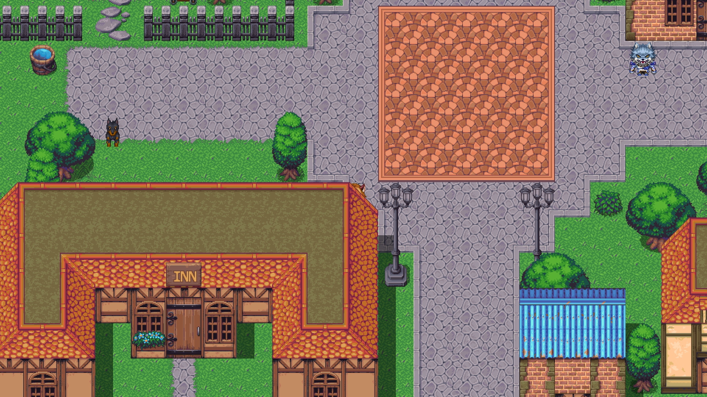

# The Endgame of SRE

A short educational game teaching SRE principles through a pixel art visual novel experience.


Originally presented at [QCon SF 2022](https://qconsf.com/speakers/amytobey)
and the [SREcon23 Americas keynote](https://www.youtube.com/watch?v=BEs6j-BOl20). Originally
built with RPGMaker MZ, this version is a rewrite in Rust using the Bevy game engine (0.19).

The game was intended for a single talk following a single well-practiced path, so there will
be some weird interactions if you do not follow that exact path. The main example being the
inn, if you interact with the characters around the table they have their old dialog. If you
interact with the map at the table you get the dialog that was presented.

## About

**The Endgame of SRE** is a dialogue-driven exploration game (no combat) that teaches Site Reliability Engineering concepts through character interactions:

- **Error budgets** and service level objectives (SLOs)
- **Organizational culture** and team dynamics
- **Psychological safety** in engineering teams
- **SRE best practices** in a story-driven format

**Technical Stack:**
- Engine: Bevy 0.19 (Rust game engine)
- Graphics: Pixel art JRPG style (48x48 tiles, 960x540 resolution)
- Assets: Visustella Fantasy Tiles MZ (licensed)

## Screenshots




## Quick Start

### Prerequisites

- Rust toolchain (2024 edition)
- For Windows builds: `cargo xwin` (`cargo install cargo-xwin`)

### Play on Linux

```bash
cargo run
```

### Building for the Web (WebAssembly)

The game runs in the browser via `wasm32-unknown-unknown`, built with the
[Bevy CLI](https://thebevyflock.github.io/bevy_cli/) (note: install from git —
the `bevy_cli` name on crates.io is only a reservation):

```bash
rustup target add wasm32-unknown-unknown
cargo install --git https://github.com/TheBevyFlock/bevy_cli --locked bevy_cli

# Serve locally at http://127.0.0.1:4000 (dev profile, fast iteration)
bevy run web

# Deployable static bundle (wasm-opt'd) in target/bevy_web/web-release/sregame/
bevy build --release web --bundle
```

### Cross-Compiling for Windows

From Linux or WSL:

```bash
# Install cargo-xwin if not already installed
cargo install cargo-xwin

# Build Windows executable + copy required DLLs
./build-windows.sh
```

The script will:
1. Cross-compile using `cargo xwin` for the `x86_64-pc-windows-msvc` target
2. Detect required DLLs using `objdump`
3. Copy necessary runtime libraries to the build directory

Output: `target/x86_64-pc-windows-msvc/debug/sregame.exe` (and `.dll` files)

## License

See `LICENSE` file.

## References

- SREcon23 Americas keynote recording: https://www.youtube.com/watch?v=BEs6j-BOl20
- USENIX presentation page: https://www.usenix.org/conference/srecon23americas/presentation/tobey
- Bevy Engine: https://bevyengine.org
- VisuStella MZ Sample Game Project: https://visustella.itch.io/visumz-sample
